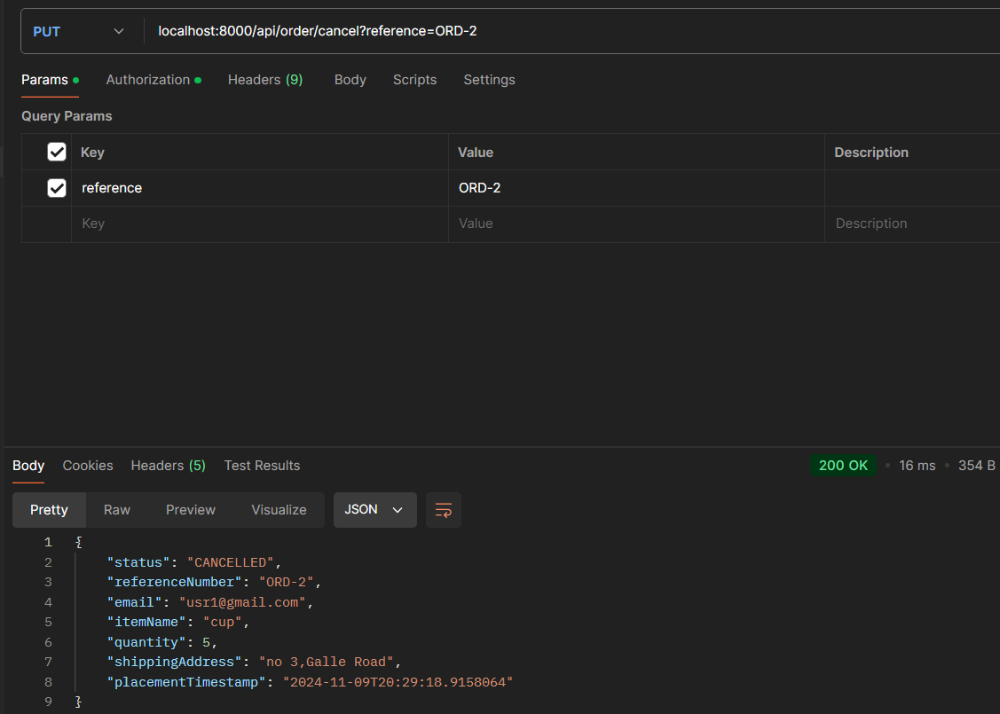
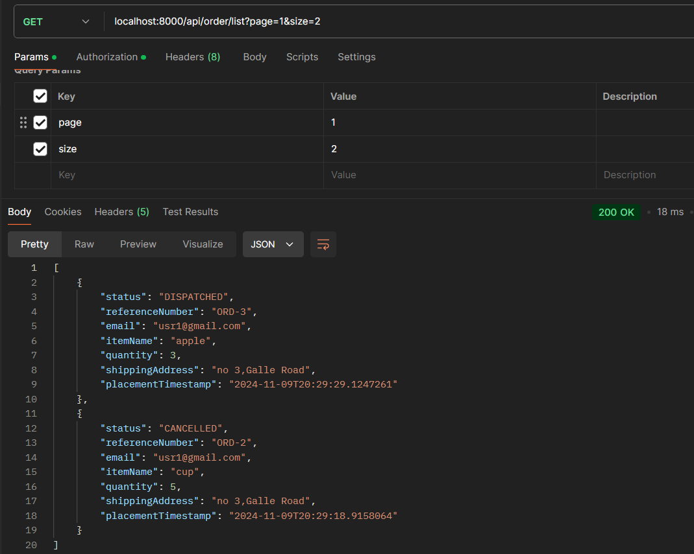

# order-management-API-platform

## Data Storing

In memory Cache is used to store data. If it is migrated to a database,
below DDL scripts can be used to create tables.
```
CREATE TABLE User (
    email VARCHAR(255) NOT NULL PRIMARY KEY,
    password VARCHAR(255) NOT NULL,
    first_name VARCHAR(100) NOT NULL,
    last_name VARCHAR(100) NOT NULL
);

CREATE TABLE `Order` (
    reference_number VARCHAR(50) NOT NULL PRIMARY KEY,
    email VARCHAR(255) NOT NULL,
    item_name VARCHAR(255) NOT NULL,
    quantity INT NOT NULL,
    shipping_address TEXT NOT NULL,
    status ENUM('NEW', 'DISPATCHED', 'CANCELLED') DEFAULT 'NEW',
    placement_timestamp TIMESTAMP DEFAULT CURRENT_TIMESTAMP,
    FOREIGN KEY (email) REFERENCES User(email)
);
```
ER Diagram

## Client Sign Up

When a client is registered,BCryptPasswordEncoder instance, 
which is a specific implementation of PasswordEncoder 
that uses the BCrypt hashing function is used to encrypt the
password.


## Client Sign In

When a user is logged in, an auth token is generated. Auth token
should be used in the auth header of the order endpoints.


## Order placement


## Order cancellation


## Fetch order history with Pagination


## Dockerize the Application
 - Package the application to create the JAR file
 - Then, navigate to the location where the Dockerfile 
is located and run the following commands
   (in Docker Desktop) to build the Docker image 
and run the container
```
docker build -t order-management-api .
docker run -p 8000:8000 order-management-api
```
